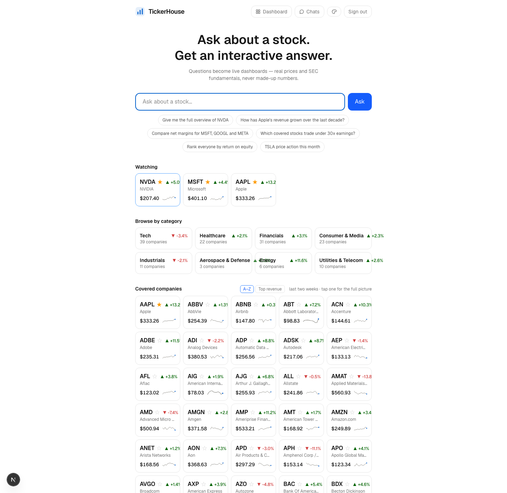

# 045 — UI: watchlist star, home section, interest instrumentation

**Status:** done

Part 3 of 3 (043 PG, 044 tools, 045 UI). Depends on 043; independent of 044. Make the
watchlist visible and one-click, and instrument the UI interactions that the session
summarizer (task 039) already treats as interest signals so they persist to pg instead of
living only inside one chat session.

## Watchlist controls

- Star toggle on each company tile (HomeScreen) and in the company-overview header. Filled =
  watching. Optimistic toggle, server action calls addToWatchlist/removeFromWatchlist from
  043. Anonymous visitors: hide the star (auth gates it, same as chats).
- "Watching" section at the top of the home screen: the user's active watchlist as the same
  company tiles, before the full universe grid (which stays sorted per task 030). Empty
  watchlist renders nothing — no empty-state banner.
- Tiles for watched tickers outside the fundamentals universe (price-only coverage) still
  work: tile shows symbol + last close, click opens the price-chart canvas instead of the
  overview (coverage rule already exists in the chat system prompt; mirror it here).

## Interest instrumentation (server actions, not client fetches)

Wire `recordInterest` from 043 into existing flows:
- company tile click → overview canvas (task 009 path): `overview_view`
- cmd+click explain popover (tasks 020/032/034 path): `explain_click` with the element label
  in context
- dashboard widget save / remove (task 019 path): `widget_saved` / `widget_removed`
- star toggle already logs via the 043 lib — no extra call here.

All fire-and-forget: a pg hiccup must never block rendering or interrupt a canvas open.

## Done when

Logged in: starring AAPL on the home screen shows it in the Watching section immediately and
survives reload; unstarring removes it. Clicking a tile, cmd+clicking an explainable element,
and saving a widget each leave one correctly-typed row in stock_interest_events (verified in
pg). Logged out: no stars, no events, nothing breaks. Screenshot of home with a 3-stock
Watching section attached to the task on completion.
